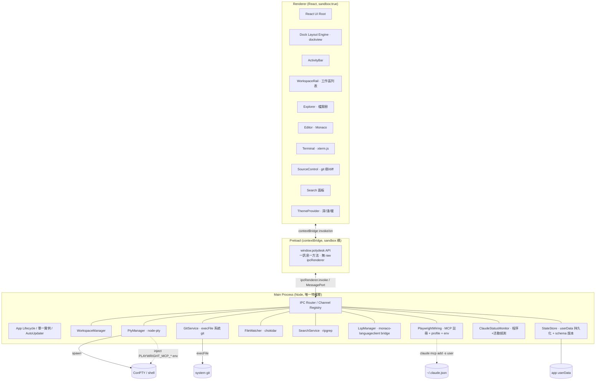
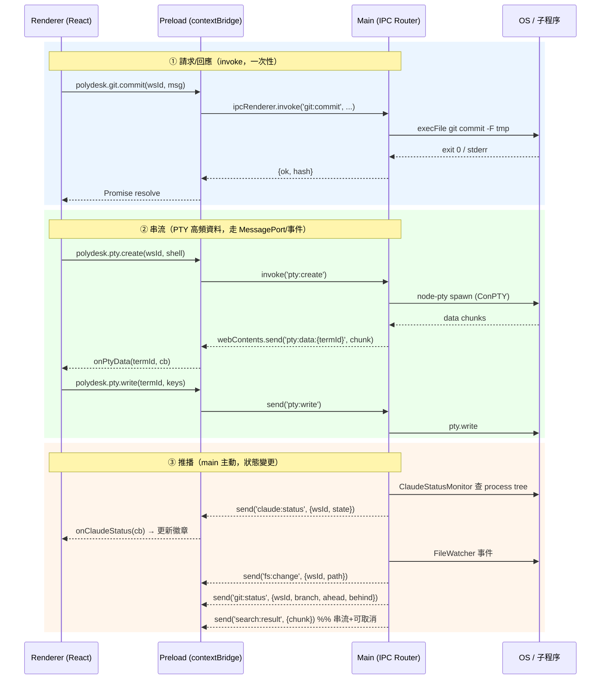

# Architecture — 多工作區開發終端機（Polydesk）

> 本檔對應凍結需求 `specs/requirements.md`，定義系統架構全景、資料流、路徑地圖與技術選型。
> 對應任務類型：`desktop-gui`（Electron + web 技術）。
> 設計原則對齊 CLAUDE.md：深層客製化 UI、最小驚訝、安全基線優先、**model 當可抽換參數**（Claude CLI 與 MCP server 名稱、版本皆參數化，不寫死行為）。

---

## 0. 架構決策摘要（ADR-lite）

| 決策 | 內容 | 對應需求 |
|---|---|---|
| **AD-1 不自建內嵌瀏覽器** | Claude 網頁測試 100% 走官方 `@playwright/mcp`（headed），app 不暴露任何無認證 CDP、不存在「工作區程式劫持已登入瀏覽器」漏洞 | REQ-PW-*, REQ-SEC-003 |
| **AD-2 系統 git，不內嵌 libgit2** | 所有 git 經 `execFile` 呼叫系統 git，繼承使用者設定/認證/SSH key | REQ-SCM-001, REQ-SCM-009 |
| **AD-3 每工作區獨立 Playwright persistent profile** | 每工作區一份 `user-data-dir`，靠 PTY 注入 env 路由；user-scope MCP 只註冊一次 | REQ-PW-001/003/005 |
| **AD-4 dockview 作 dockable layout engine** | 版面為可序列化樹狀 JSON，serialize 存 userData 做持久化與重啟還原 | REQ-UI-002/003, REQ-PERSIST-003 |
| **AD-5 main 為唯一特權層** | 所有 Node 能力（fs、spawn、pty、git、lsp）集中 main process，renderer 全 sandbox，preload 只暴露最小 IPC | REQ-SEC-001/002 |
| **AD-6 程序狀態以乾淨子程序查詢** | Claude/dev server 狀態判定不刮取終端機可見輸出，以獨立子程序查 process tree | REQ-MON-002/004 |

---

## 1. 架構全景

### 1.1 Electron 三進程分層



**分層責任**：
- **Main**：唯一能碰 fs / spawn / pty / git / 網路 的層。所有重活在此，並做為威脅模型的信任邊界（工作區程式碼視為半可信對手，REQ-SEC-003）。
- **Preload**：`contextIsolation:true` + `sandbox:true` 下的安全橋。只用 `contextBridge.exposeInMainWorld` 暴露「一個 IPC 訊息一個方法」的最小 API，**絕不**外洩 `ipcRenderer` / raw Node API。
- **Renderer**：純 UI，無 Node 能力。版面由 dockview 驅動，內容為 React component 深層客製化注入（自畫 tab/headerbar，不吃預設樣式）。

### 1.2 Main 端模組職責

| 模組 | 職責 | 對應需求 |
|---|---|---|
| **App / 單一實例** | `app.requestSingleInstanceLock()`，二次啟動把既有視窗帶前景 | REQ-PERSIST-002 |
| **AutoUpdater** | electron-updater + generic provider，輪詢 `latest.yml` 比版本→下載 blockmap 差量→`quitAndInstall` | REQ-NFR-004 |
| **WorkspaceManager** | 工作區 CRUD、去重、拖曳排序、lazy 實體化（被點到才載）、資料夾遺失偵測與 teardown 協調 | REQ-WS-* |
| **PtyManager** | 每工作區多終端機，node-pty/ConPTY spawn，cwd=工作區，注入 Playwright 接線 env，escape 硬化，崩潰回報 exit code | REQ-TERM-*, REQ-PW-003 |
| **GitService** | execFile 系統 git，argv 陣列 + `shell:false` + `--` 前置，commit message 走 `-F tempfile`，操作序列化，逾時控制，唯讀監控加固環境 | REQ-SCM-* |
| **FileWatcher** | chokidar 監看當前工作區（即時），排除 `node_modules`/`.git`，餵 Explorer 與外部修改衝突偵測 | REQ-MON-005, REQ-EDIT-007 |
| **SearchService** | ripgrep 子程序，串流結果、可取消、結果上限/分頁 | REQ-SEARCH-* |
| **LspManager** | monaco-languageclient `LanguageClientsManager` 管多 LSP；main spawn(stdio) 語言伺服器，橋到 renderer；PATH 探測偵測可用性與一鍵安裝 | REQ-EDIT-003/004/005 |
| **PlaywrightWiring** | 首次經同意 `claude mcp add polydesk-pw -s user`；每工作區 user-data-dir 管理；產生每工作區 MCP config JSON；衝突偵測；手改 JSON 走原子寫+備份 | REQ-PW-001/002 |
| **ClaudeStatusMonitor** | 以乾淨子程序查 PTY 之下 `claude` process 存在性+活動（最近輸出/子程序），判三態；前景即時、背景輪詢 5s 自適應放大 | REQ-MON-001/002/005/006 |
| **StateStore** | userData 持久化（工作區清單/名稱/設定/主題/版面/開檔清單），schema 版本+遷移，損毀自動備份+預設啟動，匯出/匯入 | REQ-PERSIST-* |

### 1.3 Renderer 端模組職責

| 元件 | 職責 | 對應需求 |
|---|---|---|
| **Dock Layout Engine (dockview)** | 面板拖曳 resize / 停靠重排 / 顯隱 / 終端機最大化；layout `toJSON` 存 userData、`fromJSON` 還原、一鍵重設 | REQ-UI-002/003 |
| **ActivityBar** | 左側功能切換（Explorer / Search / SourceControl 等） | REQ-UI-001 |
| **WorkspaceRail** | 最上層切換軸：工作區列表 + 主狀態徽章（Claude 三態）+ 拖曳排序 + 右鍵/hover 操作 + 空狀態歡迎頁 | REQ-WS-*, REQ-MON-001 |
| **Explorer** | 檔案樹，反映 FileWatcher 事件 | REQ-WS-004 |
| **Editor (Monaco)** | 開/編/存、語法高亮、TS/JS 內建智能、LSP IntelliSense、分割並排共享 model、編碼/換行保留、外部修改提示 | REQ-EDIT-* |
| **Terminal (xterm.js)** | 多終端機分頁、PTY 串流渲染、shell 切換、崩潰重啟、escape 硬化呈現 | REQ-TERM-* |
| **SourceControl** | git 變更樹、diff、stage/commit/push/pull/branch/history/stash、N/A 狀態正確顯示 | REQ-SCM-*, REQ-MON-003 |
| **Search** | 串流結果列表、可取消、點擊跳檔跳行高亮 | REQ-SEARCH-* |
| **ThemeProvider** | 深/淺/暖三主題即時切換+持久化；CSS 變數 token 化（深層客製化基底） | REQ-THEME-* |

---

## 2. 資料流向圖（IPC 模式）

IPC 分三類通道，全部經 preload 收斂：



**通道設計要點**：
- **請求/回應**：`ipcRenderer.invoke` ↔ `ipcMain.handle`，用於 git、檔案讀寫、工作區 CRUD、search 啟動/取消、MCP 註冊等。
- **串流（PTY）**：高頻 binary chunk。建議 PTY 資料走專用 `MessageChannelMain` / `MessagePort` 直連，降低主執行緒 IPC 序列化負擔以達 REQ-PERF-004（<50ms 按鍵延遲）；控制訊息（create/resize/close）仍走 invoke。
- **推播事件**：main → renderer 單向 `webContents.send`，含 Claude 三態、fs 變更、git 狀態、search 串流結果、外部修改衝突、auto-update 進度。所有事件帶 `wsId` 以路由到正確面板。
- **背景更新策略**：當前工作區 = FileWatcher 即時；背景工作區 = ClaudeStatusMonitor/GitService 輪詢（預設 5s、隨工作區數自適應放大間隔，REQ-MON-005/006）。

---

## 3. 路徑地圖（src/ 目錄結構）

```
polydesk/
├─ package.json                # 鎖定所有 library 版本（見 §4）
├─ electron-builder.yml        # NSIS target / asarUnpack / publish(generic)
├─ vite.config.ts              # Monaco worker(?worker) + LSP/vscode-api 設定
├─ dev-app-update.yml          # 開發期模擬 auto-update
├─ src/
│  ├─ main/                    # ── Main Process ──
│  │  ├─ index.ts              # app 入口 / 單一實例 lock / 視窗建立
│  │  ├─ ipc/
│  │  │  ├─ router.ts          # 通道註冊表（channel registry）
│  │  │  └─ channels.ts        # 通道名常數（與 shared 對齊）
│  │  ├─ workspace/
│  │  │  ├─ WorkspaceManager.ts
│  │  │  └─ workspaceLifecycle.ts   # lazy 實體化 / teardown
│  │  ├─ pty/
│  │  │  ├─ PtyManager.ts      # node-pty / ConPTY
│  │  │  └─ envInjection.ts    # PLAYWRIGHT_MCP_* 注入 + 機密衛生
│  │  ├─ git/
│  │  │  ├─ GitService.ts      # execFile 系統 git
│  │  │  ├─ gitSafeArgs.ts     # argv + -- 前置 + 名稱驗證
│  │  │  └─ gitSerialQueue.ts  # 同工作區序列化
│  │  ├─ fs/
│  │  │  ├─ FileWatcher.ts     # chokidar
│  │  │  └─ fileService.ts     # 讀/寫/編碼偵測/換行保留
│  │  ├─ search/
│  │  │  └─ SearchService.ts   # ripgrep 串流 + cancel
│  │  ├─ lsp/
│  │  │  ├─ LspManager.ts      # 多 LSP 生命週期
│  │  │  ├─ languageRegistry.ts# 副檔名→語言伺服器登錄表
│  │  │  └─ serverProbe.ts     # PATH 探測 / 一鍵安裝
│  │  ├─ playwright/
│  │  │  ├─ PlaywrightWiring.ts# claude mcp add / 衝突偵測
│  │  │  ├─ profileManager.ts  # 每工作區 user-data-dir
│  │  │  └─ mcpConfigWriter.ts # 原子寫 + 備份 ~/.claude.json
│  │  ├─ monitor/
│  │  │  ├─ ClaudeStatusMonitor.ts  # 程序+活動偵測（乾淨子程序查詢）
│  │  │  └─ processProbe.ts    # process tree 查詢（不刮終端機輸出）
│  │  ├─ store/
│  │  │  ├─ StateStore.ts      # userData 持久化
│  │  │  ├─ schema.ts          # schema 版本 + 遷移
│  │  │  └─ importExport.ts    # 匯出/匯入
│  │  ├─ security/
│  │  │  └─ spawnEnv.ts        # 子程序環境白名單清洗
│  │  └─ update/
│  │     └─ AutoUpdater.ts     # electron-updater
│  ├─ preload/                 # ── Preload ──
│  │  ├─ index.ts              # contextBridge.exposeInMainWorld('polydesk', api)
│  │  └─ api.ts                # 一訊息一方法的最小 API 定義
│  ├─ renderer/                # ── Renderer (React) ──
│  │  ├─ main.tsx              # React root + MonacoEnvironment 設定
│  │  ├─ App.tsx
│  │  ├─ layout/
│  │  │  ├─ DockLayout.tsx     # dockview 整合 + serialize/restore/reset
│  │  │  └─ panelRegistry.ts   # 面板 → React component 映射
│  │  ├─ components/
│  │  │  ├─ ActivityBar.tsx
│  │  │  ├─ WorkspaceRail.tsx  # 工作區列表 + 徽章 + 拖曳排序
│  │  │  ├─ Explorer.tsx
│  │  │  ├─ Editor/            # Monaco wrapper + LSP client + 分割共享 model
│  │  │  ├─ Terminal/          # xterm.js + PTY 串流接線
│  │  │  ├─ SourceControl/     # git 樹 + diff viewer
│  │  │  └─ Search.tsx
│  │  ├─ theme/
│  │  │  ├─ ThemeProvider.tsx
│  │  │  └─ tokens.css         # 深/淺/暖 CSS 變數
│  │  └─ ipc/
│  │     └─ client.ts          # 封裝 window.polydesk 呼叫
│  └─ shared/                  # ── 跨進程共用 ──
│     ├─ types.ts              # Workspace / TermState / GitStatus / ClaudeState 等
│     ├─ channels.ts           # IPC 通道名（main/preload/renderer 共用單一真相）
│     └─ constants.ts          # 逾時值 / 輪詢間隔 / 忽略目錄 等
└─ resources/                  # icon / NSIS 資源
```

**主功能 → 模組對照**：

| 功能（需求群） | Renderer | Preload 通道 | Main 模組 |
|---|---|---|---|
| 工作區管理 (WS) | WorkspaceRail | `workspace:*` | WorkspaceManager |
| 狀態監控 (MON) | WorkspaceRail 徽章 / 各面板 | `claude:status`/`git:status`(推播) | ClaudeStatusMonitor / GitService |
| 終端機 (TERM) | Terminal (xterm) | `pty:*`(串流) | PtyManager / envInjection |
| 編輯器 (EDIT) | Editor (Monaco) | `fs:*` / `lsp:*` | fileService / LspManager |
| 原始碼控制 (SCM) | SourceControl | `git:*` | GitService |
| Playwright 接線 (PW) | （PTY 自動接線，無專屬 UI） | `playwright:wire` | PlaywrightWiring / profileManager |
| 全域搜尋 (SEARCH) | Search | `search:run`/`search:cancel`/`search:result` | SearchService |
| 主題/版面 (THEME/UI) | ThemeProvider / DockLayout | `store:layout`/`store:theme` | StateStore |
| 持久化 (PERSIST) | — | `store:*` | StateStore |
| 安全/打包/更新 (SEC/NFR) | — | `update:*` | spawnEnv / AutoUpdater |

---

## 4. 技術選型表

> **model 當可抽換參數**：Claude CLI 路徑、MCP server 名稱（`polydesk-pw`）、Playwright channel、LSP 伺服器清單皆以 config/常數注入，不在程式碼寫死特定 model 行為。版本一律鎖 `package.json` 並對齊官方 docs（2026 高頻迭代）。

| 技術 | 版本基準 | 選用理由（一句） |
|---|---|---|
| **Electron** | 33+ | 桌面殼層生態最成熟、最貼近 VSCode 體驗、node-pty/Monaco/builder 一條龍最穩。 |
| **React** | 19.x | UI 元件化、dockview/Monaco/xterm 皆有一等 React adapter，社群最大。 |
| **TypeScript** | 5.x | 跨三進程共用型別（`src/shared`）、IPC 契約靜態檢查、降低接縫漂移。 |
| **Vite** | 6.x | Electron renderer 打包與 HMR 最快，`?worker` 原生支援 Monaco worker。 |
| **dockview** (`dockview-react`) | 4.x | 原生 tab 拖曳/上下左右停靠/floating/popout，layout 可 `toJSON`/`fromJSON` 直接餵持久化（覆蓋 REQ-UI-002/003 + REQ-PERSIST）。 |
| **Monaco Editor** | 0.5x | VSCode 同源編輯器，內建 TS/JS 智能、語法高亮、minimap、多游標，符合「取代 VSCode」體驗。 |
| **monaco-languageclient** | 10.x | 內建 `LanguageClientsManager` 管多 LSP、通用 LSP 橋接（REQ-EDIT-003）；須與 `@codingame/monaco-vscode-api` + monaco-editor 三方版本鎖定匹配。 |
| **xterm.js** (`@xterm/xterm`) | 5.x | 業界標準終端機渲染（VSCode 同款），WebGL/canvas renderer 達 <50ms 延遲，與 node-pty 天然搭配。 |
| **node-pty** | 1.x | 微軟官方 real PTY（Windows ConPTY），多 shell 支援；`@electron/rebuild` + `asarUnpack` 打包（REQ-NFR-003）。 |
| **system git** (execFile) | 使用者環境 | 繼承使用者 git 設定/認證/SSH key，避免內嵌 libgit2 的認證與相容地雷（REQ-SCM-001）。 |
| **ripgrep** (`rg`) | 14+ | 跨檔搜尋最快、原生串流與忽略規則，符合可取消/不卡 UI（REQ-SEARCH-004）。 |
| **chokidar** | 4.x | 跨平台 fs 監看，glob 排除重目錄（`node_modules`/`.git`），背景監控低開銷。 |
| **@playwright/mcp** | latest（鎖定） | 官方 MCP，headed 即時觀看、persistent profile 隔離；以 `claude mcp add -s user` 註冊一次、PTY 注入 env 路由每工作區 profile（REQ-PW-*）。 |
| **electron-builder** | 25+ | Windows NSIS 打包 + `asarUnpack` 原生模組；產出 Setup.exe/blockmap/latest.yml（REQ-NFR-003）。 |
| **electron-updater** | 6.x | generic provider 自架 HTTPS 靜態檔輪詢更新，讓 Chromium CVE 可被修補（REQ-NFR-004）。未簽章首裝 SmartScreen trade-off 已記錄，出貨後補簽章。 |

---

## 5. 關鍵接縫契約（design.md 詳釋，此處點名）

- **IPC 契約**：`src/shared/channels.ts` + `src/shared/types.ts` 為 main/preload/renderer 三方單一真相，任何通道增刪先改此處。
- **Playwright 接線契約**：PTY 注入的 env 變數名（`PLAYWRIGHT_MCP_CONFIG` 指向每工作區 config JSON 最穩；`PLAYWRIGHT_MCP_USER_DATA_DIR` 需實機驗證）+ user-data-dir 命名規則 + MCP managed marker。
- **LSP 三方版本鎖**：monaco-languageclient / monaco-vscode-api / monaco-editor 版本矩陣必須匹配，亂配白屏。
- **StateStore schema**：版本欄位 + 遷移函式 + 損毀備份策略；版面 JSON 即 dockview serialize 產物。
- **安全邊界**：spawnEnv 白名單（PATH/USERPROFILE/SystemRoot…）剔除 `PLAYWRIGHT_MCP_*` 與無關 `GIT_*`；接線 env 只進 PTY、不進 git/telemetry。

---

## 6. 威脅模型（對齊 REQ-SEC-003）

- **對手**：工作區內執行的程式碼（半可信）。加入工作區即一次信任授權（REQ-WS-008）。
- **不暴露面**：無內嵌瀏覽器、無無認證 CDP 端口（AD-1）→ 杜絕「工作區程式劫持已登入瀏覽器」。
- **隔離**：renderer sandbox + contextIsolation；子程序最小環境；每工作區 Playwright profile 互斥（同 profile 併發禁用）。
- **注入防禦**：git 一律 argv + `shell:false` + `--` 前置 + 名稱格式驗證 + commit message 經檔案/stdin。
- **誠實單點**：main/GPU process 為 Electron 固有單點故障，不假裝可隔離（REQ-NFR-002）。
